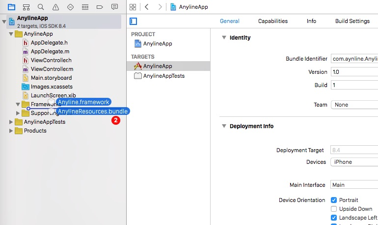
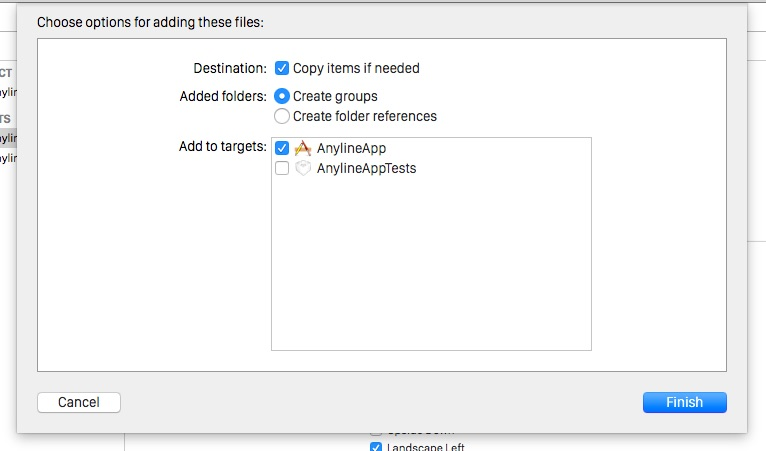
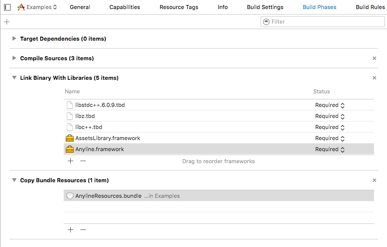
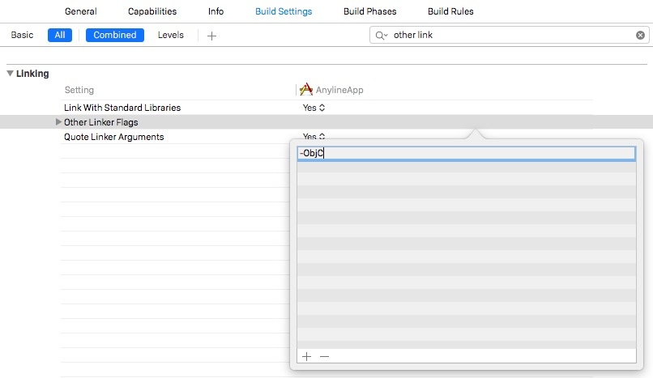

# Introduction

Anyline provides an easy-to-use SDK for applications to enable Optical Character Recognition (OCR) on mobile devices. 
This API contains a [Quick Start Guide] (#getting-started) for all supported platforms, a detailed description for the [Anyline Config] (#anyline-config) as well as descriptions and examples for the available [modules] (#modules).

### Supported Platforms
- Android
- iOS
- WP (by Q3 2015)
	
### Available Modules
- **Barcode & QR Code:**  Scan 16 international barcodes & QR codes
- **Meter Reading:** Scan meter readings of various electric, gas, water or heat meters
- **Passport (MRZ):**  Reliable scanning of data from passports' machine readable zones (MRZ)
- **Custom:** We will support you when implementing other use cases for mobile OCR technology.

# Getting Started

## Android ##

The bundle contains the following parts: 


- **AnylineSDK:**      contains the anyline-android-release.aar
- **Documentation:**    contains java doc for the anyline-sdk
- **AnylineSDKExamples:**      contains a simple app where each module is implemented, it can be installed right away
- **LICENSE:** 			third party license agreements
- **README:**			containing a quick start - setup and module description


### Requirements

- Android device with SDK >= 15
- decent camera functionality (recommended: 720p and adequate auto focus)


### Quick Start Guide
> Add AnylineSDK to the dependencies in build.gradle

```plaintext
//root section of the file
repositories {
    flatDir {
        dirs 'libs'
    }
}
 
dependencies {
    compile(name:'AnyLineSDK', ext:'aar')
    //... your other dependencies
}
```

#### 1. Copy AnylineSDK.aar to your apps "libs" directory and modify the build.gradle as shown in the example.

###### &NewLine;  

#### 2. Provide a config file (json or xml)

> Example barcode_view_config.json:

```json
{
	"captureResolution":"720p",
  	"cutout": {
		"style": "rect",
		"maxWidthPercent": "80%",
		"alignment": "center",
		"ratioFromSize": {
	     	"width": 100,
	     	"height": 80
		},
		"strokeWidth": 2,
		"cornerRadius": 4,
		"strokeColor": "FFFFFF",
		"outerColor": "000000",
		"outerAlpha": 0.3
	 },
	 "flash": {
		"mode": "manual",
	 	"alignment": "bottom_right"
	 },
	 "beepOnResult": true,
	 "vibrateOnResult": true,
	 "blinkAnimationOnResult": true,
	 "cancelOnResult": true
}
```

The config file enables a quick and easy adaption of the "Scan-View". You can either provide a json-file or use the XML-attributes directly in the layout file.
The detailed description of all available attributes can be found in [Anyline Config] (#anyline-config)

##### JSON

This config file must be located in the "assets" folder of your Android Project.

Some of the most important config options may be:

Paramter | Description 
-------- | -----------
captureResolution | the preferred camera preview size
cutout | defining which area of the preview will be "cutout" (analysed to find bar/qr code)
flash | defines the flash mode, where to place the flash symbol etc.
beepOnResult | enables sound on successful scanning process
vibrateOnResult | provides haptic feedback for a successful scanning process
blinkOnResult |  visual feedback for a successful scanning process
cancelOnResult | if true, the scanning process will be stopped after one result and needs to be started manually again

###### XML
> Example activity_layout.xml

```xml
<RelativeLayout
	 xmlns:android="http://schemas.android.com/apk/res/android"
	 xmlns:app="http://schemas.android.com/apk/res-auto"
	 android:layout_width="match_parent"
	 android:layout_height="match_parent">
	<at.nineyards.anyline.modules.energy.EnergyScanView
	    android:id="@+id/energy_scan_view"
	    android:layout_width="match_parent"
	    android:layout_height="match_parent"
	    app:cutout_alignment="top"
	    app:cutout_style="rect"
	    app:cutout_outside_color="#55000000"
	    app:cutout_offset_y="120"
	    app:cutout_rect_corner_radius_in_dp="4"
	    app:cutout_stroke_width_in_dp="2"
	    app:cutout_stroke_color="#FFFFFF"
	    app:flash_mode="manual"
	    app:flash_alignment="bottom_right"
	    app:beep_on_result="true"
	    app:vibrate_on_result="true"
	    app:blink_animation_on_result="true"
	    app:cancel_on_result="true"
	 />
</RelativeLayout>
```

Alternatively you may also configure the view (EnergyScanView, MrzScanView, BarcodeScanView) using XML-attributes in the layout-file.

###### &NewLine;  

####3.Init Anyline in your Activity
There are module specific options - take a look at the description in the desired [module] (#modules) description.

####4. Enjoy scanning and have fun :)


##iOS##

- **Framework:**        contains the Anyline.framework & AnylineResources.bundle
- **Documentation:**    contains a html & docset version of an appledoc style interface documentation
- **AnylineExamples:**  contains a simple app where each module is implemented, it can be installed right away
- **LICENSE:** 			third party license agreements
- **README:**			containing a quick start - setup and module description
- **RELEASE_NOTES**


### Requirements

- minimum iOS 7.0
- minimum iPhone4s


### Quick Start - Setup

#### 1. Import the files

Simply drag & drop Anyline.framework & AnylineResources.bundle into your project tree.



In the import screen select "Copy items if needed" and "Create groups" and add the files to your target.


#### 2. Linking Frameworks

After the framework and bundle got imported go to your project inspector. Under the "Build Phases" tab add the following libraries:

- libc++.dylib
- libstdc++.6.0.9.dylib
- libiconv.dylib
- AssetsLibrary.framework	

After you have added them it should look like this (notice the AnylineResources bundle. If its not in "Copy Bundle Resources" add it):


#### 3. Linker Flags 

In your project inspector switch to the "Build Settings" tab  and search for "Other Linker Flags". Under Other - "Other Linker Flags" add "-ObjC". 
This flag causes the linker to load every object file in the library that defines an Objective-C class or category.




####4. Init an AnylineModuleView in your ViewController or Storyboard

There are module specific options - take a look at the description in the desired [module] (#modules) description.


####5. Enjoy scanning and have fun :)


# Anyline Config

With the config file the views can be configured in regard of postion and looks of the cutout as well as flash behaviour, feedback on scan, etc. 

## Item description

```json
{
      "captureResolution": "720p",
      "cutout": {
          "style": "rect",
          "width": 540,
          "maxWidthPercent": "80%",
          "maxHeightPercent": "80%",
          "alignment": "center",
          "image":"Overlay",
          "ratioFromSize": {
              "width": 125,
              "height": 85
          },
          "strokeWidth": 2,
          "strokeColor": "FFFFFF",
          "cornerRadius": 4,
          "offset": {
              "x": 0,
              "y": 0
          },
          "cropPadding": {
              "x": 0,
              "y": 0
          },
          "cropOffset": {
              "x": 0,
              "y": 0
          },
          "outerColor": "000000",
          "outerAlpha": 0.3
      },
      "flash": {
          "mode": "manual",
          "alignment": "bottom_right",
          "imageOn": "ic_flash_on",
          "imageOff": "ic_flash_off",
          "imageAuto": "ic_flash_auto"
      },
      "beepOnResult": false,
      "vibrateOnResult": true,
      "blinkAnimationOnResult": true,
      "cancelOnResult": true
}
```

* [captureResolution] (#captureResolution)  *String*
* [cutout] (#cutout) 
  * [width] (#cutout_width) *int*
  * [maxWidthPercent] (#cutout_maxWidthPercent)  *String*
  * [maxHeightPercent] (#cutout_maxHeightPercent)  *String*
  * [ratioFromSize] (#cutout_ratioFromSize) 
     * [width] (#cutout_ratioFromSize) *int*
     * [height] (#cutout_ratioFromSize)  *int*   
  * [alignment] (#cutout_alignment)  *String*
  * [offset] (#cutout_offset) 
     * [x] (#cutout_offset)  *int*
     * [y] (#cutout_offset) *int*
  * [outerColor] (#cutout_outerColor)  *Hex-String*  - format: RRGGBB
  * [outerAlpha] (#cutout_outerAlpha)  *float*
  * [style] (#cutout_style)  *String* 
  * [strokeColor] (#cutout_strokeColor)  *Hex-String* - format: RRGGBB
  * [strokeWidth] (#cutout_strokeWidth)  *int*
  * [cornerRadius] (#cutout_cornerRadius)  *int*
  * [image] (#cutout_image)  *String*
  * [cropPadding] (#cutout_cropPadding)  
     * [x] (#cutout_cropPadding)  *int*
     * [y] (#cutout_cropPadding) *int*
  * [cropOffset] (#cutout_cropOffset)  
     * [x] (#cutout_cropOffset)  *int*
     * [y] (#cutout_cropOffset) *int*
* [flash] (#flash) 
  * [mode] (#flash_mode)  *String*
  * [alignment] (#flash_alignment)  *String*
  * [imageOn] (#flash_imageOn)  *String*
  * [imageOff] (#flash_imageOff)  *String*
  * [imageAuto] (#flash_imageAuto)  *String*
* [beepOnResult] (#beepOnResult)  *boolean*
* [vibrateOnResult] (#vibrateOnResult)  *boolean*
* [blinkAnimationOnResult] (#blinkAnimationOnResult)  *boolean*
* [cancelOnResult] (#cancelOnResult)  *boolean*

[**Android Specifics**] (#androidSpecifics)

* [captureResolution] (#captureResolution2)  *String*
* [Configure via XML] (#configureViaXML)
	* [List of all XML options] (#configureViaXML)
	* [Differences to json] (#differencesToJson)
	
<a name="captureResolution"></a>
### captureResolution

The Resolution of the preview frame.

**Possible values:**

value | description
----- | -----------
1080p |	use 1920x1080 as preferred preview size
720p  | use 1280x720 as preferred preview size
480p  |	use 480x854 as preferred preview size


 - The p is optional. 
 - The defined capture resolution is just the preferred resolution. If this resolution is not available the resolution that best fits inside the desired resolution should be used.
 
<a name="cutout"></a>
###cutout

This contains all the settings for the overlay/cutout.


<a name="cutout_width"></a>
#### width 

Specifies an exact desired pixel width (pixels in the frame, not on the display). If this is bigger than the views width, it will be limited to it. 

E.g. Android devices may have a 720p preview but only a 540p wide display. If a width of 600 is specified, the cutout will still only be 540. 

- **Type:** 		int
- **Default:** 		none

<a name="cutout_maxWidthPercent"></a>
#### maxWidthPercent

Specifies the maximum width of the cutout in percent.

This is the desired width if 'width' parameter is not used.

- **Type:**			String
- **Format:**		###%
- **Range:**		1% - 100%
- **Default:**		100%

<a name="cutout_maxHeightPercent"></a>
####maxHeightPercent
 
Specify the maximum height of the cutout in %.

- **Type:**			String
- **Format:**		###%
- **Range:**		1% - 100%
- **Default:**		100%

**_Why width and maxWidth and maxHeight but no height?_**

The form of the cutout can be defined by the ratio, so there is no direct need for width AND height parameter.
But if there is only one width parameter where % or pixel value is allowed, it is not possible to limit the height to a certain percentage.
That limits the usability in landscape mode quite a bit.

<a name="cutout_ratioFromSize"></a>
####ratioFromSize
The ratio of the cutout can be defined by just setting this parameters width and height to the size of the real object that should be
scanned.

E.g. width = 100 height = 50 is the same as width = 200 height = 100, because only the ratio matters here.

- **Type of width and height:** int
- **Default ratio:** 			1 (width = 1, height = 1)

<a name="cutout_alignment"></a>	
####alignment
The alignment of the cutout.

**Possible values:**

value | description
----- | -----------
top | upper border of the cutout is at the upper border of the view
top_half | offsetY = (viewHeight - cutoutHeight) / 3
center | cutout is centered in the view vertically and horizontally
bottom | lower border of the cutout is at the lower border of the view
bottom_half | the same as tophalf just from below: offsetY = (viewHeight - cutoutHeight) / 3 * 2

<a name="cutout_offset"></a>
####offset
Move the cutout in x and y direction by the specified pixel value. 

Put negative values to move left or up, positiv values to move right or down.

The offset is limited to move the cutout to the start/end of the view.
 
- **Type:** int (pixel value - pixels in the frame, not on the display)

<a name="cutout_outerColor"></a>
####outerColor
The color of the area outside the cutout.

- **Type:** Hex-String 
- **Format:** RRGGBB

<a name="cutout_outerAlpha"></a>
####outerAlpha
The alpha value for the color outside of the cutout.

- **Type:** float
- **Range:** 0-1 
   - 0 = view is completely transparent
   - 1 = view is completely opaque

<a name="cutout_style"></a>
####style
The type of the cutout.

style | description | related parameters
----- | ----------- | -------------------
rect | a rectangle is drawn around the cutout-area | strokeWidth, strokeColor, cornerRadius
image | a given image is drawn inside the cutout-area (resized to fit) | image

<a name="cutout_strokeColor"> </a>
####strokeColor
The color of the stroke (used by rect or vector style).

- **Type:** Hex-String 
- **Format:** RRGGBB

<a name="cutout_strokeWidth"> </a>
####strokeWidth
The thickness of the stroke in a diplay independent unit 

- **Type:** int (density-independent pixel dp)

<a name="cutout_cornerRadius"> </a>
####cornerRadius
The radius to round the corners of the rect (only used if type is rect).

 - **Type:** int (density-independent pixel dp)

<a name="cutout_image"> </a>
####image
The name of the image resource (only used if type is image).

- **Type:** String

<a name="cutout_cropPadding"> </a>
####cropPadding
If the part that is cropped out of the frame differs from the visible cutout in width and height by the x or y padding.

Positive values mean that the crop will be smaller than the cutout.  Negative values mean that the crop will be bigger than the cutout.

The padding is all around the cutout so cropWidth = cutoutWidth - 2 * xPadding.

This should only be used in combination with a fixed width (which also fits on all supported devices), because this is a fixed value that will not be adjusted to anything.

- **Type:** int (pixel value)

<a name="cutout_cropOffset"> </a>
####cropOffset
Move the part that is cropped out of the frame away from the visible cutout by the x and y.

Negative values to move left or up, positiv values to move right or down.

This should only be used in combination with a fixed width (which also fits on all supported devices), because this is a fixed value that will not be adjusted to anything.

- **Type:** int (pixel value)

<a name="flash"> </a>
###flash

<a name="flash_mode"> </a>
####mode
The settings for a simple view that provides flash functionality.

Default images for flash on/off/auto are provided.

**Possible values:** 

mode | description 
---- | ------------
none | flash view is not used and not visible
manual | flash can be toggled manually  (default is off)
auto | flash view also has an automatic option which is the default option. But it is still required to tell the view when it should turn on the flash in auto mode. (Exept for use-cases where additional abstraction is provided like the Energy-Meter-Module)

<a name="flash_alignment"> </a>
####alignment
The alignment of the flash view.

alignment | meaning
--------- | -------
top |at the top centered horizontally
top_left | at the top left corner
top_right |at the top right corner
bottom | at the bottom centered horizontally
bottom_left | at the bottom left corner
bottom_right | at the bottom right corner

<a name="flash_imageOn"> </a>
####imageOn
The name of the custom image resource to show when the flash is on.

The image will not be resized and should be provided in an appropriate size.

- **Type:** String

<a name="flash_imageOff"> </a>
####imageOff
The name of the custom image resource to show when the flash is off.

The image will not be resized and should be provided in an appropriate size.

- **Type:** String


<a name="flash_imageAuto"> </a>
####imageAuto
The name of the custom image resource to show when the flash is in auto mode.

The image will not be resized and should be provided in an appropriate size.

- **Type:** String

###Special options for Modules

Modules can use these additional options to configure some things that should happen when a result was found.

<a name="beepOnResult"> </a>
####beepOnResult
True, if there should be a beep when a result is found.

- **Type:** boolean

<a name="vibrateOnResult"> </a>
####vibrateOnResult
True, if there should be a vibration alarm when a result is found.

- **Type:** boolean

<a name="blinkAnimationOnResult"> </a>
####blinkAnimationOnResult
True, if the view should display a short flash of white when a result is found.

- **Type:** boolean

<a name="cancelOnResult"> </a>
####cancelOnResult
True, if the scanning process should be canceled when a result is found (=default setting).

Set to false if multiple things should be scanned immediately after each other.
If another scan may be required later, leave this value true and just restart the scanning process later

- **Type:** boolean
- **Default:** true (cancel scanning when result is found)

<a name="androidSpecifics"> </a>
### Android Specifics

<a name="captureResolution2"> </a>
####captureResolution
The capture resolution is a suggestion, because the available preview sizes vary from device to device. 
If the "suggested" resolution is available, it will be used, if not a resolution that fits best within the views size will be used.

<a name="configureViaXML"> </a>
####Configure via XML

> Where app is xmlns:app="http://schemas.android.com/apk/res-auto"

```xml
app:preferred_preview_width="720"
app:preferred_preview_height="1280"
app:cutout_alignment="top"
app:cutout_style="rect"
app:cutout_outside_color="#55000000"
app:cutout_offset_x="0"
app:cutout_offset_y="160"
app:cutout_crop_padding_x="0"
app:cutout_crop_padding_y="0"
app:cutout_crop_offset_x="0"
app:cutout_crop_offset_y="0"
app:cutout_width="540"
app:cutout_max_width_percent="90"
app:cutout_max_height_percent="90"
app:cutout_ratio_from_size_width="540"
app:cutout_ratio_from_size_height="98"
app:cutout_rect_corner_radius_in_dp="4"
app:cutout_stroke_width_in_dp="2"
app:cutout_stroke_color="#FFFFFF"
app:flash_mode="manual"
app:flash_alignment="bottom_right"
app:flash_image_on="@drawable/flash_icon"
app:flash_image_off="@drawable/flash_icon_off"
app:flash_image_auto="@drawable/flash_icon_auto"
app:beep_on_result="true"
app:vibrate_on_result="true"
app:blink_animation_on_result="true"
app:cancel_on_result="true"
```

The configuration can also be done via xml instead of json.

A list of of all available xml options can be found in the example.

<a name="differencesToJson"> </a>
#####Differences to json
- tree is "flattened" and snake_case
- captureResolution is defined by preferred_preview_width and preferred_preview_height
- colors contain alpha value, so there is no extra option for alpha

<a name="iosConfig"> </a>
## iOS Config of ModuleView

There are two methods to add the view for the models availbale.

<a name="iosConfigModuleViewCode"> </a>
### 1. Configure the iOS ModuleView in Code

The view exposes the following properties:
 
 
value | description
----- | ----------
strokeWidth	| sets the width of the views border
strokeColor | sets the color of the views border
cornerRadius | Sets the corner radius of the views border
outerColor | sets the color of the space surrounding the view
outerAlpha | sets the alpha of the space surrounding the view
flashImage	| sets image the user uses to toggle the flash
flashButtonAlignment | sets the alignment of the flash button
flashStatus	| read the status of the flash
cancelOnResult | this property tells Anlyine if it should stop scanning once a result was found
beepOnResul | true, if there should be a beep when a result was found
blinkOnResult | true, if there should be a blinking alarm when a result was found
vibrateOnResult	| true, if there should be a vibration alarm when a result was found

##### flashButtonAlignment
specifies the alignment of the flash button

**Possible values:**

alignment | description 
--------- | -----------
ALFlashAlignmentTop | aligned at top, centered horizontally
ALFlashAlignmentTopLeft | aligned at top left corner
ALFlashAlignmentTopRight | aligned at top right corner
ALFlashAlignmentBottom | aligned at bottom, centerd horizontally
ALFlashAlignmentBottomLeft | aligned at bottom left corner
ALFlashAlignmentBottomRight | aligned at bottom right corner

<a name="iosConfigModuleViewStoryboard"> </a>
### 2. Configure the iOS ModuleView with Storyboards
1. Select "View" from the object library
2. Drag it onto the view of your view controller
3. Change the class to the name of the module you want to use (AnylineBarcodeModuleView, AnylineMRZModuleView, AnylineEnergyModuleView)

![AddView] (images/docAddView.jpg)


##### Changing the appearance
The appearance of the view can be changed in the attributes inspector.

![ConfigView] (images/docConfigView.jpg)

###### Creating the property

> Module Outlet

```objective_c
@interface MainViewController : UIViewController
 
@property (weak, nonatomic) IBOutlet AnylineBarcodeModuleView *moduleView;
 
@end
```

Define the outlet of the view in the interface of the view controller.

###### Connecting the module view to your view controller
Drag the connector of you property to the newly created view. 

![Connect] (images/docConnect.jpg)

# Modules

The Anyline-Modules are use-case specific abstractions for Anyline. Each module is designed to serve a specific purpose. Currently, the following modules are availble:

- [Barcode] (#barcodeModule)
- [Energy] (#energyModule)
- [MRZ (Machine Readable Zone)] (#mrzModule)

<a name="barcodeModule"> </a>
## Barcode 

With the Anyline-Barcode-Module 16 different kinds of bar- and qr-codes can be scanned. The result will simply be a *String* representation of the code.

#### Restrictions for the Barcode-Module Config:
- Flash mode "auto" is not (yet) supported.

#### Available Barcode Formats:  
            
- AZTEC
- CODABAR
- CODE_39
- CODE_93
- CODE_128
- DATA_MATRIX
- EAN_8
- EAN_13
- ITF
- PDF_417
- QR_CODE
- RSS_14
- RSS_EXPANDED
- UPC_A
- UPC_E
- UPC_EAN_EXTENSION

### Android 

#### Example

The following example files illustrate a simple use-case of the barcode module.

###### Example  Activity

```java
barcodeScanView = (BarcodeScanView) findViewById(R.id.barcode_scan_view);
barcodeScanView.setConfigFromAsset("barcode_view_config.json");
 
// initialize Anyline with your license key and a Listener that is called if a result is found
barcodeScanView.initAnyline(ANYLINE_LICENSE, new BarcodeResultListener() {
    @Override
    public void onResult(String result) {
        // This is called when a result is found.
 
    }
});
barcodeScanView.startScanning();
```

There are three simple steps necessary to get started:

1. If you do not use XML configuration set the [config-file] (#barcodeConfig) to your BarcodeScanView using the *setConfigFromAsset* method and make sure that the json config-file is located in the Android **assets** folder
2. InitAnyline with your valid license key and a new instance of BarcodeResultListener, which can be used to handle the bar/qr code results.
3. call *startScanning()*

###### &NewLine;

```java
// limit the barcode scanner to QR codes or CODE_128 codes
barcodeScanView.setBarcodeFormats(BarcodeScanView.BarcodeFormat.QR_CODE, BarcodeScanView.BarcodeFormat.CODE_128);
```

In an optional step, you can limit the barcode scanning to one or multiple barcode formats with setBarcodeFormats(BarcodeScanView.BarcodeFormat...);

###### Example Activity Layout

```xml
<RelativeLayout
    xmlns:android="http://schemas.android.com/apk/res/android"
    android:layout_width="match_parent"
    android:layout_height="match_parent">
 
 <at.nineyards.anyline.modules.barcode.BarcodeScanView
    android:id="@+id/barcode_scan_view"
    android:layout_width="match_parent"
    android:layout_height="match_parent"/>
</RelativeLayout>
```

The BarcodeScanView can simply be included in the activity layout file, just like any other view. The view can be either configured here via XML or otherwise a config json file can be used to adapt the "Scan View", like seen

<a name="barcodeConfig"> </a>
###### Example config for the Barcode Module

```json
{
  "captureResolution":"720p",
 
  "cutout": {
    "style": "rect",
    "maxWidthPercent": "80%",
    "alignment": "center",
    "ratioFromSize": {
      "width": 100,
      "height": 80
    },
    "strokeWidth": 2,
    "cornerRadius": 4,
    "strokeColor": "FFFFFF",
    "outerColor": "000000",
    "outerAlpha": 0.3
  },
  "flash": {
    "mode": "manual",
    "alignment": "bottom_right"
  },
  "beepOnResult": true,
  "vibrateOnResult": true,
  "blinkAnimationOnResult": true,
  "cancelOnResult": true
}
```

The config file enables a quick and easy adaption of the "Scan-View".

Some of the most important config options may be:

Parameter | Description
--------- | -----------
captureResolution | the preferred camera preview size
cutout | defining which area of the preview will be "cutout" (analysed to find bar/qr code)
flash | defines the flash mode, where to place the flash symbol etc.
beepOnResult | enables sound
vibrateOnResult | haptic feedback for a succesful scanning process
blinkOnResult |visual feedback for a successful scanning process
cancelOnResult | if true, the scanning process will be stopped after one result and needs to be started manually again

A detailed description of all available config items can be found in [Anyline Config] (#anyline-config)

It is also possible to use xml-attributes instead of the json config file. For more detailed information see [XML Configuration] (#configureViaXML)


### iOS

There are three steps necessary to get a scan result:

######1. Initialize the module in viewDidLoad

```objective_c
- (void)viewDidLoad {
    self.barcodeModule = [[AnylineBarcodeModuleView alloc] initWithFrame:CGRectMake(0, 0, 640, 640)];
   [self.view addSubview:self.barcodeModule];
    BOOL success = [self.barcodeModule setupWithLicenseKey:kMyLicenseKey delegate:self error:&error];
    if( !success ) {
        // Handle the error here
    }
    [self.barcodeModule setBarcodeFormats:@[kCodeTypeEAN8, kCodeTypeEAN13, kCodeTypeQR]]
}
```

Create a property, initialize the module in the viewDidLoad method and add it to the view of the view controller.

Supply the license key and set the delegate, which will receive a call once a result is found. 

The boolean returned by the setup routine notifies if the Anyline set up was successful. If an error occured the error needs to be handled.

If the setup was successful, set the barcode types that should be scanned. 

Valid types are:

- kCodeTypeAztec
- kCodeTypeCodabar 
- kCodeTypeCode39
- kCodeTypeCode93 
- kCodeTypeCode128,
- kCodeTypeDataMatrix
- kCodeTypeEAN8
- kCodeTypeEAN13 
- kCodeTypeITF
- kCodeTypePDF417 
- kCodeTypeQR,
- kCodeTypeRSS14 
- kCodeTypeRSSExpanded
- kCodeTypeUPCA
- kCodeTypeUPCE
- kCodeTypeUPCEANExtension

###### 2. Start scanning

```objective_c
- (void)viewDidAppear:(BOOL)animated {
    [super viewDidAppear:animated];
    NSError *error;
    BOOL success = [self.barcodeModule startScanningAndReturnError:&error];
    NSAssert(success, @"Start failed: %@",error.debugDescription);
    if( !success ) {
        // Handle the error here
    }
}
```   
Once Anyline is set up sucessful, start the scanning process in viewDidAppear.
If there is a problem starting the scanning process an error object will be set, so the error can be handled.

###### 3. Receiving results

```objective_c
- (void)anylineBarcodeModuleView:(AnylineBarcodeModuleView *)anylineBarcodeModuleView
               didFindScanResult:(NSString *)scanResult
                         atImage:(UIImage *)image {
    NSLog("Scan result: %@", scanResult);
}
```
When a valid result is found, it will call the delegate. The scan result will be a string containing the scanned code.


## Energy 

The Anyline-Energy-Module is capable of scanning analog electric- and gas-meter-readings.
Moreover, it is possible to scan bar- and qr-codes as well as serial numbers for meter identification.

For each successful scan, you will receive four result-attributes:

- **scanMode:** the mode the result belongs to
- **result**: the detected value as a String
- **resultImage**:
	 - scanMode = meter: the cropped image that has been used to scan the meter value
	 - scanMode = code: null
- **fullImage**:
	 - scanMode = meter: the full image (before cropping)
	 - scanMode = code: null

    
###Android

##### Restrictions for the Energy-Module Config
- Capture resolution is currently fixed to 720p on android (optimized for good results on as many devices as possible).
- The size and ratio of the cutout is predefined and cannot be changed (sizes are optimized for best results)
- The cutout should be placed fairly high (use alignment top and a small y offset), because this reduces reflections a lot if used with flash.
- Flash mode "auto" is not (yet) supported.

#### Example
The following example files illustrate a simple use-case of the energy module.

###### Example  Acitivity

```java
energyScanView = (EnergyScanView) findViewById(R.id.energy_scan_view);
 
// set the scan mode to start with
energyScanView.setScanMode(EnergyScanView.ScanMode.ELECTRIC_METER);
 
// initialize Anyline with your license key and a Listener that is called if a result is found
energyScanView.initAnyline(ANYLINE_LICENSE, new EnergyResultListener() {
    @Override
    public void onResult(EnergyScanView.ScanMode scanMode, String result,
                         AnylineImage resultImage, AnylineImage fullImage) {
 
        // This is called when a result is found.
        // The scanMode is the mode the result was found for. The result is the actual result.
        // If the a meter reading was scanned two images are provided as well, one shows the targeted area only
        // the other shows the full image. (Images are null in barcode mode)
        // The result for meter readings is a String with leading zeros (if any) and no decimals.
 
    }
});
energyScanView.startScanning();
```


In order to start the scan process, perform the following steps:

1. If you prefer a json-file for configuration, use the *setConfigFromAsset* method and place the json-config in the Android **assets** folder, otherwise configure the view using the xml attributes in the activity layout file.
2. set the scan mode; availabe are: ELECTRIC_METER, GAS_METER, BAR_CODE
3. initAnyline with your valid license key and a new instance of EnergyResultListener, which is the callback for handling the results
4. call *startScanning()* 


###### Example Activity Layout

```xml
<RelativeLayout
    xmlns:android="http://schemas.android.com/apk/res/android"
    xmlns:app="http://schemas.android.com/apk/res-auto"
    android:layout_width="match_parent"
    android:layout_height="match_parent">
 
<at.nineyards.anyline.modules.energy.EnergyScanView
    android:id="@+id/energy_scan_view"
    android:layout_width="match_parent"
    android:layout_height="match_parent"
    app:cutout_alignment="top"
    app:cutout_style="rect"
    app:cutout_outside_color="#55000000"
    app:cutout_offset_y="120"
    app:cutout_rect_corner_radius_in_dp="4"
    app:cutout_stroke_width_in_dp="2"
    app:cutout_stroke_color="#FFFFFF"
    app:flash_mode="manual"
    app:flash_alignment="bottom_right"
    app:beep_on_result="true"
    app:vibrate_on_result="true"
    app:blink_animation_on_result="true"
    app:cancel_on_result="true"
    />
 
</RelativeLayout>
```

The EnergyScanView can simply be included in the activity layout.

For custom configuration (e.g. cutout, flash, feedback for successful scanning, etc.) you can either use a json-file or XML-attributes like in the example. If you need more detailed information about all availbale config items see [Anyline Config] (#anyline-config).

Capture resolution is currently fixed to 720p on Android, which was optimized for good results on as many devices as possible.

	
	
	
###iOS	

####Restrictions for the Energy-Module Config:
- Flash mode "auto" is not (yet) supported.

#### Example
	
In order to get scan results it is necessary to perform the following three steps:

###### 1. Initialize the module in viewDidLoad

```objective_c
- (void)viewDidLoad {
    self.energyModule = [[AnylineEnergyModuleView alloc] initWithFrame:CGRectMake(0, 0, 640, 640)];
   [self.view addSubview:self.energyModule];
    BOOL success = [self.energyModule setupWithLicenseKey:kMyLicenseKey delegate:self error:&error];
    if( !success ) {
        // Handle the error here
    }
    [self.energyModule setScanMode:ALElectricMeter];
}
```

Create a property, initialize the module and add it to the view of our view controller.
Afterwards supply the license key and set the delegate. The delegate will receive a call when a result is found. 
If the Anyline set up returned an error the error object will be set and you can handle the error.
Furthermore it is necessary to set the scan mode utilizing *setScanMode*. 

Possible values are:
 
- ALElectricMeter 
- ALGasMeter
- ALBarcode 
- ALSerialNumber

###### 2. Start the scanning process in viewDidAppear

```objective_c
- (void)viewDidAppear:(BOOL)animated {
    [super viewDidAppear:animated];
    NSError *error;
    BOOL success = [self.energyModule startScanningAndReturnError:&error];
    NSAssert(success, @"Start failed: %@",error.debugDescription);
    if( !success ) {
        // Handle the error here
    }
}
```
If there is an error staring the scanning process the error object will be set and you can handle the error.

###### 3. Implement the delegate method and receive results
    

```objective_c
- (void)anylineEnergyModuleView:(AnylineEnergyModuleView *)anylineEnergyModuleView
              didFindScanResult:(NSString *)scanResult
                      cropImage:(UIImage *)image
                      fullImage:(UIImage *)fullImage
                         inMode:(ALScanMode)scanMode; {
    NSLog("Scan result: %@", scanResult);
}
```

Once Anyline has found a valid result the delegate will be called and you get an result object with four result attributes. 

- **scanMode:** the mode the result belongs to
- **scanResult**: the detected value as a String
- **image**:
	 - scanMode = meter: the cropped image that has been used to scan the meter value
	 - scanMode = code: null
- **fullImage**:
	 - scanMode = meter: the full image (before cropping)
	 - scanMode = code: null


## MRZ 

The Anyline-MRZ-Module provides the functionality to scan passports and other IDs using the MRZ (machine-readable-zone).

For each scan result the module generates an Identification Object, containing all relevant information as well as the image of the scanned document.

<a name="scannedInfo"> </a>
**Information scanned:**

value | description
----- | -----------
expirationDate | The expiration date of the document
dob |	The date of birth
checkDigitDob | check digit for the date of birth
checkDigitExpiration | Check digit for the expiration date
code |	country code
surname	| surname
givenNames| all given first names
checkDigitDates	| Check digit for both dates
type |	The type of the document that was read. (ID/P)
checkDigitNumber |	Check digit for the document number
checkDigitFinal	| Check digit
sex	 | Gender of the person


*Please be aware that not every property is filled for every document type (e.g. an ID MRZ does not contain a sex, a passport does).*


### Android

#####Restrictions for the MRZ-Module Config:
- The ratio of the cutout cannot be changed and is predefined to fit passports and IDs well.
- Flash mode "auto" is not (yet) supported.

####Example
The following example files illustrate a simple use-case of the MRZ module.

###### Example Activity

```java
mrzResultView = (MrzScanView) findViewById(R.id.mrz_result);
mrzScanView.setConfigFromAsset("mrz_view_config.json");
 
// initialize Anyline with your license key and a Listener that is called if a result is found
mrzScanView.initAnyline(ANYLINE_LICENSE, new MrzResultListener() {
 
    @Override
    public void onResult(Identification mrzResult, AnylineImage anylineImage) {
 
        // This is called when a result is found.
        // The Identification includes all the data read from the MRZ
        // as scanned and the given image shows the scanned ID/Passport
    }
});
mrzScanView.startScanning();
```

There are three simple steps necessary to get started:

1. If you do not use XML configuration set the [config-file] (#mrzConfig) to your mrzScanView using the *setConfigFromAsset* method and make sure that the json config-file is located in the Android **assets** folder
2. InitAnyline with your valid license key and a new instance of  MrzResultListener, which will be used as callback for each successful scan.
3. call *startScanning()*

###### Example Activity Layout

```xml
<RelativeLayout
    xmlns:android="http://schemas.android.com/apk/res/android"
    xmlns:tools="http://schemas.android.com/tools"
    android:layout_width="match_parent"
    android:layout_height="match_parent">
 
    <at.nineyards.anyline.modules.mrz.MrzScanView
        android:id="@+id/mrz_view"
        android:layout_width="match_parent"
        android:layout_height="match_parent"/>
</RelativeLayout>
```

The MrzScanView can simply be included in the activity layout file, just like any other view. The view can be either configured via XML or otherwise a config json file can be used to adapt the "Scan View".

<a name="mrzConfig"> </a>
###### Example config for the MRZ Module

```json
{
    "captureResolution":"1080p",
    "cutout": {
        "style": "rect",
        "maxWidthPercent": "90%",
        "maxHeightPercent": "90%",
        "alignment": "top_half",
        "strokeWidth": 2,
        "cornerRadius": 4,
        "strokeColor": "FFFFFF",
        "outerColor": "000000",
        "outerAlpha": 0.3
    },
    "flash": {
        "mode": "manual",
        "alignment": "bottom_right"
    },
    "beepOnResult": true,
    "vibrateOnResult": true,
    "blinkAnimationOnResult": true,
    "cancelOnResult": true
}
```

A detailed description of all available config items can be found in [Anyline Config] (#anyline-config)

It is also possible to use xml-attributes instead of the json config file. For more detailed information see [XML Configuration] (#configureViaXML)


### iOS

#####Restrictions for the MRZ-Module Config:
- Flash mode "auto" is not (yet) supported.

#### Example

There are three steps necessary to get a scan result:

######1. Initialize the module in viewDidLoad

```objective_c
- (void)viewDidLoad {
    self.mrzModule = [[AnylineMRZModuleView alloc] initWithFrame:CGRectMake(0, 0, 640, 640)];
   [self.view addSubview:self.mrzModule];
    BOOL success = [self.mrzModule setupWithLicenseKey:kMyLicenseKey delegate:self error:&error];
    if( !success ) {
        // Handle the error here
    }
}
```

Create a property, initialize the module in the viewDidLoad method and add it to the view of the view controller.

Supply the license key and set the delegate, which will receive a call once a result is found. 

The boolean returned by the setup routine notifies if the Anyline set up was successful. If an error occured the error needs to be handled.


###### 2. Start scanning process in viewDidAppear

```objective_c
- (void)viewDidAppear:(BOOL)animated {
    [super viewDidAppear:animated];
    NSError *error;
    BOOL success = [self.mrzModule startScanningAndReturnError:&error];
    NSAssert(success, @"Start failed: %@",error.debugDescription);
    if( !success ) {
        // Handle the error here
    }
}
```   
If there is a problem starting the scanning process an error object will be set, so the error can be handled.

###### 3. Implement the delegate method and receive results

```objective_c
- (void)anylineMRZModuleView:(AnylineMRZModuleView *)anylineMRZModuleView
           didFindScanResult:(ALIdentification *)scanResult
                     atImage:(UIImage *)image; {
    NSLog("Scan result: %@", scanResult);
}
```
When a valid result is found, it will call the delegate. ScanResult is an object of type ALIdentification containing the [information scanned.] (#scannedInfo)
